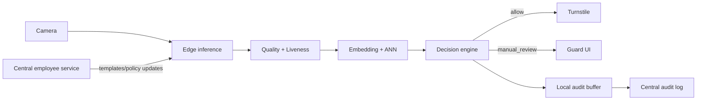

# Architecture

Гибрид: hot path на edge, управление идентичностями, enrollment, model rollout и аудит — в центре.

Hot path: camera → detect → quality → alignment → liveness → embedding → ANN → policy decision → turnstile.
Async: шаблоны/policy, аудит, мониторинг, model rollout, аналитика.
